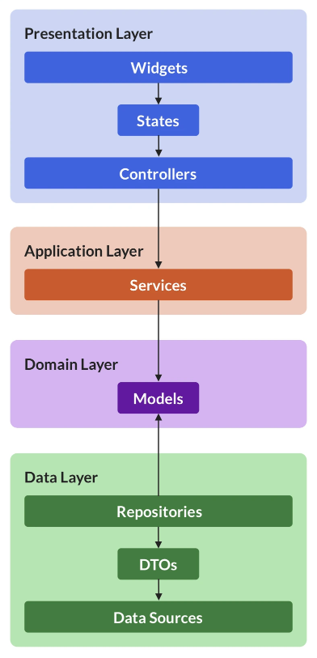
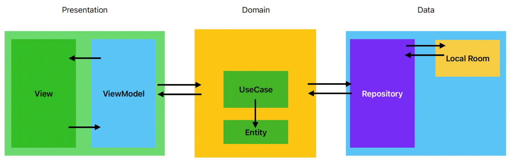
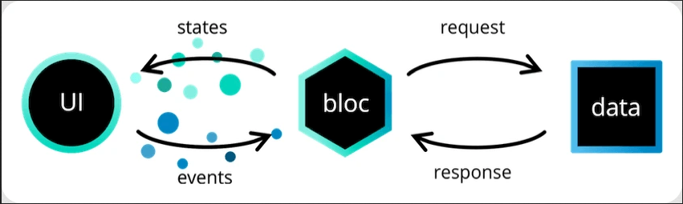
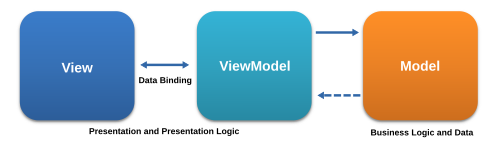

# ADR: State Management and Navigation Strategy for Flutter Apps

## Introduction
#### Status: Proposed
#### Proposal Date: Jan 31, 2025

#### Proposal Authors:
[Serene Aronow](https://github.com/Jennserene) (Led research and proposal development)  
[Armando Quintana](https://github.com/MandoQ10) (Contributed to research and data gathering)  
[Nadia Collado](https://github.com/nadiacollado) (Contributed to research and data gathering)  

### Context
This Architectural Decision Record (ADR) establishes a standardized state management and navigation solution for all future Flutter applications developed by 8th Light. Consistent architectural patterns are essential for code maintainability, scalability, and team efficiency.

Inconsistent approaches lead to increased development time, hinder onboarding of new team members, and complicate refactoring and testing efforts. For example, on a previous project, due to suboptimal state management and navigation choices, now necessitates substantial refactoring to align with best practices and lessons learned. This standardization aims to preemptively address such issues, ensuring future projects are built on a solid, scalable, and easily maintainable foundation.

### Decision
We will adopt the following technologies:
#### State Management: Riverpod Architecture
Rationale: Riverpod Architecture was chosen due to its alignment with clean code principles, ease of testing, unidirectional data flow, improved state management, and minimal boilerplate code. Additionally, the availability of a reference application and strong community support were contributing factors.
#### Navigation/Routing: GoRouter
Rationale: GoRouter was selected due to its development by the Core Flutter Team, comprehensive documentation, abundance of learning resources, full feature set, active community contributions, and ease of getting started.

### Consequences
#### Positive Consequences
- Improved code maintainability and readability. 
- Increased development speed. 
- Better testability. 
- Enhanced scalability. 
- Reduced bugs. 
- Easier onboarding of new team members. 
- Consistency across projects. 
- Availability of a reference application.
- Strong community support for GoRouter. 
- Excellent performance with Riverpod.
- Riverpod and GoRouter integrate together seamlessly.

#### Negative Consequences
- Initial learning curve for Riverpod and GoRouter  
(mitigated by the reference app). 
- Riverpod's documentation could be more comprehensive  
(but community resources help). 
- GoRouter is in maintenance mode  
(bug fixes only, no new features). 
- Potential for over-engineering for very simple apps. 
- Dependency on third-party libraries. 
- Possibility of future refactoring  
(though a good architecture minimizes this).

### Conclusion
This ADR establishes Riverpod Architecture and GoRouter as the standard state management and navigation solutions for future Flutter applications developed by 8th Light.

By standardizing on these technologies, we aim to achieve increased development speed, improved code maintainability, enhanced scalability, and greater consistency across projects. Additionally, this decision sets future Flutter teams up for success by providing a solid, easy-to-learn app architecture, preventing the need for extensive refactoring due to uninformed initial decisions. While there are potential challenges, such as an initial learning curve and documentation gaps, we believe the benefits outweigh the risks. The availability of a reference application and strong community support further solidify our confidence in this decision.

We anticipate that this decision will positively impact our development process and the quality of our Flutter applications, fostering a more efficient, maintainable, and scalable codebase.

## State Management Options Considered
While Riverpod MVVM Clean initially seemed promising, our previous implementation highlighted several challenges. The architecture's separation of concerns, while conceptually appealing, led to excessive boilerplate code and introduced complexities in maintaining clear data flow. Additionally, the use of deprecated Riverpod methods within this architecture resulted in unforeseen issues and conflicts with evolving best practices. These factors necessitate significant refactoring efforts in the existing project, prompting us to explore alternative state management solutions that offer a cleaner integration with Riverpod and a less cumbersome development experience.

### Chosen Option
#### Riverpod Architecture
Riverpod Architecture, designed by Andrea Bizzotto, is an architecture designed specifically to work with Riverpod. 
Note: It is not endorsed by Remi Rousselet (the author of Riverpod)

##### Overview
The architecture separates features into 4 layers:
- Presentation  
Contains the UI, which comprises two main types of components:  
  - Widgets: Represent the data on the screen  
  - Controllers: Perform asynchronous data mutations and manage the widget state.
- Application (optional)  
Contains Service classes that manage when to use different data sources for different controller’s uses.
- Domain  
Defines application-specific model classes that represent the data that comes from the data layer.
- Data  
Contains 3 types of classes:
  - Data Sources: 3rd party APIs to interact with data sources
  - Data Transfer Objects: The unstructured (often JSON) data returned by Data Sources
  - Repositories: Classes that make the DTOs available as type safe model classes to the rest of the app

##### Pros
- Specially designed to work well with Riverpod after much experimentation by Andrea Bizzotto
- Follow clean code principles, separate concerns into layers, which makes this easier to scale as app grows
- Enables easier unit and integration testing
- Encourages unidirectional data flow
- Improved state mgmt, which helps with global state issues of Provider
- Considerably less boilerplate code than MVVM Clean with Riverpod (seems to have the least boilerplate out of all options)

##### Cons
- Not officially recognized as an app architecture by Flutter, the author of Riverpod, or any other body.
- Riverpod’s documentation is lacking, but this is partially mitigated by thorough coverage by other articles and guides

##### References
- [CodeWithAndrea Article introducing Riverpod Architecture](https://codewithandrea.com/articles/flutter-app-architecture-riverpod-introduction/)
- [Example repository using this architecture](https://github.com/bizz84/starter_architecture_flutter_firebase)

### Alternative Solutions (not chosen)
#### Riverpod MVVM Clean
##### Overview
Riverpod is the most recommended state management solution. MVVM Clean is a popular app architecture recommended by Principle Engineer Barry Geipel. Combining the two initially seems to be a viable approach to implementing the app architecture to enable separation of concerns, enhancing testability and reliability. This method has already been implemented in the ~Pourri Loyalty App.

##### Pros
- Follow clean code principles, separate concerns into layers, which makes this easier to scale as app grows
- Enables easier unit and integration testing
- Encourages unidirectional data flow
- Improved state mgmt, which helps with global state issues of Provider
##### Cons
- Riverpod does not map exactly to this system of separation of concerns in its current most updated state, requiring the use of deprecated methods.
- Requires substantial boilerplate code to maintain proper separation of concerns, introducing a lot of files (UI, use cases, repos etc)
- Uses deprecated methods, causing strange problems to occasionally pop up.
- More difficult to get technical assistance, as sometimes the advice will be to refactor to updated methods.
- Could be overkill for a simple app without complex business logic
- Improper use can cause unintended rebuilds/performance issues
- Riverpod’s documentation is lacking, this is partially mitigated by thorough coverage by other articles and guides
---

#### Bloc
Bloc follows a three layer architecture that includes presentation (UI), business logic (bloc), and data.

##### Overview
- Bloc is an event driven state management library that separates presentation from business logic, allowing fast, easy to test, and reusable code.
- Bloc houses state, events, and event handlers (Bloc Class). This means every user interaction requires an event. Events update state, which is then emitted to the UI.
- State changes exclusively through defined events, enabling strict state management.
- Best suited for complex applications that require strict, event-driven state handling.

##### Pros
- Provides a strict unidirectional data flow. State changes are explicit and traceable through defined events. This is important for any applications with sensitive data where state changes must be intentional.
- Separates UI and business logic
##### Cons
- The strict state change management results in more boiler plate code.
- Boiler plate code can clutter UI (seems to have the most boilerplate out of all options)
- Does not follow the standard Flutter design pattern
##### Reference
- [Bloc Documentation](https://bloclibrary.dev/)
- [Bloc Github Repository](https://github.com/felangel/bloc/tree/master/packages/flutter_bloc)
- [It’s Not Flutter](https://dev.to/andrious/its-not-flutter-27co) - article explaining how Bloc does not follow Flutter design pattern
---
#### Stacked
##### Overview
Stacked is a flutter architecture that follows MVVM, where business logic, presentation, and data models are separated.

- Stacked follows the traditional implementation of MVVM where the ViewModel is injected as a dependency to a widget. 
- Employs BaseViewModel for state management, automatically notifying listeners of state changes.

##### Pros
- Separation of concerns as it follows MVVM
- Built in dependency injection (Service Locator) makes it easy to inject services, mock dependencies for unit testing
- Easier and more structured routing through built-in navigation service

##### Cons
- More boilerplate than Riverpod
- Could be overkill for a simple app
- You may need custom solutions for more advanced state mgmt
- Harder to onboard quickly if devs are unfamiliar with the structure
- Managed by the software agency FilledStacks
- Searching for a new core development team

##### Reference
- [Stacked Documentation](https://stacked.filledstacks.com/docs/getting-started/overview/)
- [Stacked Github Repository](https://github.com/Stacked-Org/stacked)

## Navigation/Routing Options Considered
While GoRouter has been our default navigation solution, recent developments raise concerns about its long-term viability. Our initial experience with GoRouter was less than ideal, as its implementation in a previous project now requires substantial refactoring due to misunderstandings of its intricacies. Moreover, in his [January 2025 newsletter](https://codewithandrea.com/newsletter/january-2025/), Andrea Bizzotto from CodeWithAndrea highlighted that GoRouter has entered maintenance mode, with the Flutter team focusing on bug fixes and stability rather than new features. This shift raises concerns about the package's future evolution and its ability to keep up with the evolving Flutter ecosystem. Given these factors, we are actively exploring alternative navigation solutions to ensure our projects remain on a stable and supported foundation.

### Chosen Option
#### GoRouter
##### Overview
The go-to package for routing requirements that exceed the capabilities of the built-in Navigator. GoRouter is fully featured, well maintained, and has been adopted for development by the Core Flutter Team.

##### Pros
- Developed by the Core Flutter Team
- Well documented
- Many guides and articles on how to use are easily accessible
- Fully featured
- Recent commits show contributions from a wide range of community developers
- Frequent commits
- Easier to get started

##### Cons
- Currently in Maintenance Mode - no new features planned by the Core Flutter Team
- More difficult to set up, especially with more complicated navigation structures
- Has some obscure and difficult to understand features
- Route set up can become very redundant

##### Reference
- [GoRouter Documentation](https://pub.dev/documentation/go_router/latest/topics/Get%20started-topic.html)
- [GoRouter Github Repository](https://github.com/flutter/packages/tree/main/packages/go_router)

### Alternative Solutions (not chosen)
#### AutoRoute
##### Overview
An alternative to GoRouter that leverages generated code, reducing the setup code required for complex routes.

##### Pros
- Uses code generation to automate out much of the boilerplate involved in creating more complicated routes
- Well documented
- Easy and painless to set up and use

##### Cons
- No updates since August despite many new issues and pull requests from the community
- Difficult to find support

##### Reference
- [AutoRoute Documentation](https://pub.dev/documentation/auto_route/latest/)
- [AutoRoute Github Repository](https://github.com/Milad-Akarie/auto_route_library)
---

#### Navigator with Navigation Utils
##### Overview
Navigator is the Flutter built-in routing system with no external packages required to use. Navigation Utils is a package designed to extend and enhance Navigator functionality rather than replace it.

##### Pros
- Builds upon the existing Navigator, making Flutter Docs for navigation useful
- Creator of Navigation Utils seems to be responsive and helpful

##### Cons
- Navigation Utils does not have a large user base, and it may be difficult to find support
- Navigation Utils documentation is lacking

##### Reference
- [Navigation Utils Documentation](https://pub.dev/documentation/navigation_utils/latest/)
- [Navigation Utils Github Repository](https://github.com/rayliverified/NavigationUtils)
